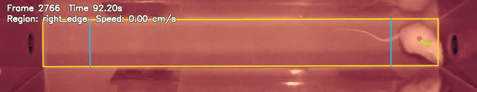

# LiTraQ

LiTraQ is an independently developed, general-purpose Python toolkit for movement quantification and transit-event quality control in linear-track experiments. It reports distance, speed, edge occupancy, shuttle behavior, and straight-transit events from DeepLabCut tracking data. Both a GUI and a command-line interface are included.

LiTraQ was originally developed to analyze the alternate poking reward omission (APRO) paradigm, but its analysis pipeline is task-agnostic and can be applied to compatible tracking data from other linear-track experiments. LiTraQ is not an official implementation of the APRO paradigm and is not affiliated with or endorsed by its original authors.

## Files

- `litraq.py`: calibration, movement analysis, event detection, and QC output
- `litraq_gui.py`: PyQt6 GUI for single-file and batch analysis

## Requirements

- Python 3.10 or later
- NumPy
- pandas
- OpenCV
- Matplotlib
- PyQt6
- PyAV (optional; improves random video access)

```bash
pip install numpy pandas opencv-python matplotlib PyQt6 av
```

## Usage

Start the GUI:

```bash
python litraq_gui.py
```

Select a processed video, a DeepLabCut filtered CSV or H5 file, and an arena calibration JSON file. Use the Batch tab to process multiple videos.

For command-line help:

```bash
python litraq.py --help
python litraq.py analyze --help
```

Main outputs include per-frame movement metrics, time-bin and edge-region summaries, straight-transit candidates and accepted events, shuttle events, and optional QC videos.

## End-to-end transit analysis

LiTraQ detects and quantifies end-to-end transits between opposing end zones. The example below shows a representative, human-reviewed straight transit accepted by LiTraQ; the overlay displays the tracked body-center path and end-zone boundaries.



## Methods text (copy-ready)

The following text describes APRO-session analysis performed with the current default parameters:

> Mouse trajectories during alternate poking reward omission (APRO) sessions were analyzed from DeepLabCut tracking data using LiTraQ (Linear-track Trajectory Analysis and Quantification; https://github.com/mi2e-K/LiTraQ). Movement was defined as speed of at least 1.0 cm/s after excluding bouts shorter than 0.20 s or with net displacement below 0.50 cm. Straight end-to-end transits between opposing 6.5-cm end zones were identified using LiTraQ’s default criteria.

## APRO reference

Naik AA, Ma X, Munyeshyaka M, Leibenluft E, Li Z. A New Behavioral Paradigm for Frustrative Nonreward in Juvenile Mice. *Biological Psychiatry: Global Open Science*. 2024;4:31-38. https://doi.org/10.1016/j.bpsgos.2023.09.007

## DeepLabCut references

Mathis A, Mamidanna P, Cury KM, et al. DeepLabCut: markerless pose estimation of user-defined body parts with deep learning. *Nature Neuroscience*. 2018;21:1281-1289. https://doi.org/10.1038/s41593-018-0209-y

## Notes

Verify video and DLC frame counts, arena calibration, and straight-transit QC before interpreting results. The wall-posture classifier is a 2D proxy derived from a top-down view and does not directly establish rearing.

## License

LiTraQ is released under the [MIT License](LICENSE).
